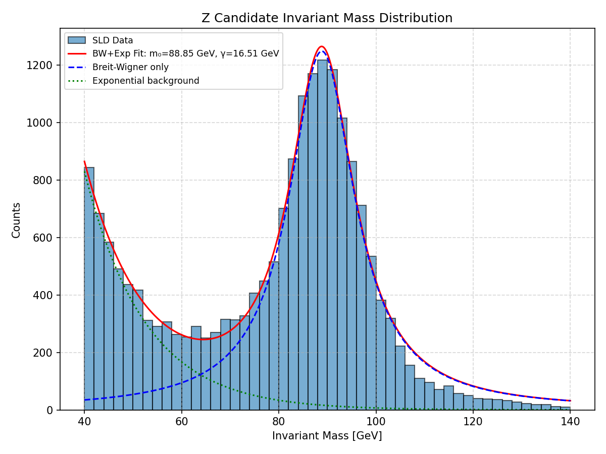

# Jazelle Reader – SLD MiniDST Stream Utilities

A Python package to read SLD MiniDST files in Jazelle format. Based on the original Java implementation: [Jazelle by Tony Johnson](https://github.com/tony-johnson/Jazelle).

## Features

- Conversion from Jazelle/MiniDST to Parquet.
- Z boson mass analysis over Parquet.

## Requirements

- Python 3.12+
- Dependencies (conversion): `numpy`, `pyarrow`, `rms-vax`
- Dependencies (analysis): `matplotlib`, `pandas`

## Structure

```
.
├── README.md
├── convert_minidst.py  # Main conversion script
├── analysis            # Sample analysis
├── banks               # Bank readers
├── stream              # Stream handlers
└── utils               # Utility functions
```

## Usage

Clone the repository:

```bash
git clone https://github.com/amete/jazelle_reader.git
cd jazelle_reader
```

You can run the conversion as follows (see all options with the option `-h`):

```bash
python3 convert_minidst.py <input_file>
```

This will produce a Parquet version of the Jazelle file, e.g.:

```
Converting Jazelle file: /global/cfs/projectdirs/m5115/SLD/minidst/qf1065.qf1065$5nrec97v18_mdst_1$7b1

Writing Parquet to data/qf1065.qf1065_5nrec97v18_mdst_1_7b1.parquet (compression=zstd) ...
Saved: data/qf1065.qf1065_5nrec97v18_mdst_1_7b1.parquet (66.52 MB)
```

You can read this file with `pandas`, e.g.:

```
import pandas as pd
df = pd.read_parquet('data/qf1065.qf1065_5nrec97v18_mdst_1_7b1.parquet')
```

A basic Z boson mass analysis is also provided in `analysis/z_mass.py`.
Executing this script as:

```bash
python3 z_mass.py --input-dir data/
```

where `data/` contains all the parquet files, will give you a plot similar to:



in the current directory.
